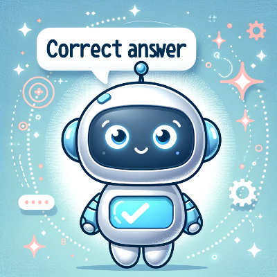

# Heading 1

## Heading 2

### Heading 3

#### Heading 6

This is some normal text

**This is bold text**

_This is italic text_

# Lists

### Unordered

- List Item 1
- List Item 2
  - List Item 1

* List Item 1
* List Item 2
  - List Item 2.1

### Ordered

1. List Item 1
2. List Item 2
3. List Item 3
   1. List Item 3.1
   2. List Item 3.2

4. List Item 1
5. List Item 2
   1. List Item 2.1
   2. List Item 2.2

## Links

[Text Displayed](link)

[Google](https://www.google.com/)

## Images

[Alt](Source)



## Blockquotes

My favorite quote is:

> Quote Line 1
>
> Quote Line 2

## Strikethrough

~~strike this text~~

## Tables

| Technology   | Description | Link    |
| ------------ | ----------- | ------- |
| Some Content | Content     | Content |
| Some Content | Content     | Content |
| Some Content | Content     | Content |
| Some Content | Content     | Content |
| Some Content | Content     | Content |
| Some Content | Content     | Content |

## Inline code

This is a `console.log()`

## Code Snippets

```javascript
const test = "This is a test";
console.log(test);
```

<!-- This content will not appear in the rendered Markdown -->
